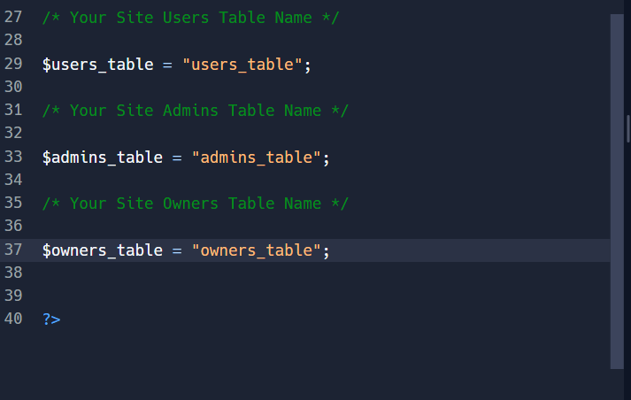

# This is A Template For A PHP Login Form Using A RemoteMySQL DataBase And Run on Replit.
<h4>
<ul> <li>You Need To <a href="https://remotemysql.com/databases.php?action=new" target="_blank">Create A DataBase</a>, You Can Create A Free One At RemoteMySQL (If You Already Have A DataBase You Can Skip The First Part)</li>
<li><a href="#already">
Already Have A DataBase
</a>
</li>
<li><a href="#tools">Some Premade Tools</a></li>
<li><a href="#issues">Issues</a></li>
<a href="https://replit.com/@MortexAG/PHP-Login-Form" target="_blank"><li>This Template's Repl Link</a></li>
<li><a href="https://github.com/MortexAG/PHP-Login-Form" target="_blank">This Template's Github Repository</a></li><li><a href="https://login.mortexagsite.cyou" target="_blank">Test This Template On My Site</a></li></ul>
</h4>

<h2 id="create">Create A Free DataBase In RemoteMySQL
</h2>
<h4>
<ol>
  <li>Register A New Account On <a href="https://remotemysql.com" target="_blank">RemoteMySQL Site</a></li>
   
  
   
  
<li>
  <a href="https://remotemysql.com/databases.php?action=new" target="_blank">Use This Link To Create A DataBase Directly And Skip Surveys</a></li>
 

 

  <li>Now You Need To Keep The Username And Password And The DataBase Name And The Server Name.</li>
   
  
   
  <li id="already">Make Them Environment Secrets In This Repl For Better Security, "db_username" For The Username And "db_password" For The Password And "server" For The Server, And "db_name" For The Database Name Which Will Be The Same As Your Username If You're Using RemoteMySQL, Or Add Them Directly In The "config.php" <ul> <li>But If You Want To Use A Method Of Them Use It On All Your Data Or The Database Won't Be Connected.</li></ul></li>
   
  
   
  <ul>
    <li>You Can Make Environment Secrets With Whatever Names You Want But Make Sure To Add Them To The "config.php".</li></ul>
   
  
   
  <li>Make Three Tables In Your DataBase One For The Users List, Another For The Admins List, And Another One For The Owners List.</li>
   
  <li>The "id" Column Of All The Tables Must Be Primary.</li>
   
  
   
  <li>All Of The Tables Must Have 4 Columns (id, username, password, nickname) (NOTHING IS IN CAPITAL).</li>
   
  
   
  <li>To Add The Owner Info Into The Owner Table You Either Do It Manually Or Run The File "add_owner.php" By Typing The Link Followed By It as in "https://PHP-Login.yourname.repl.co/add_owner.php". <ul style="color:red;">
     
    
     
    
     
    <li>BUT REMEMBER TO REMOVE THESE "add_owner.php" AND "add_owner_code.php" FROM THE REPL AS SOON AS YOU DO THIS TO PREVENT ANYONE FROM ACCESSING IT AND ADDING A NEW OWNER.</li></ul>
  </li>
   
  <li>Now All You Need To Do Is Adding Your Information In The "config.php" As The Table Names And Your Site And Page Name You Will Find Leading Comments in The File.</li>
   

 

 

or

 

 
</ol>

</h4>

<h2 id="tools">Some Premade Tools</h2>
<h4>
  <ol>
    <li>For The Owner There Is The Show Users And Admins List, And A Tool To Register New Site Admins.</li>
    <li>For Admins There Is A Tools To Show Them A List OF The Site's Users Who Registered An Account On The Site And A List Of The Site's Admins , This Information Is Fetched Directly From Your Database Tables Which Are Used To Insert The User Information.</li>
    <li>For Normal Users On Your Site There Are No Tools.</li>
  </ol>
</h4>
<h2 id="issues">Issues</h2>
<h4>
  <ul>
    <li>Please Comment Any Issues You Find And I Will Reply As Soon As I Can.
  </ul>
</h4>

